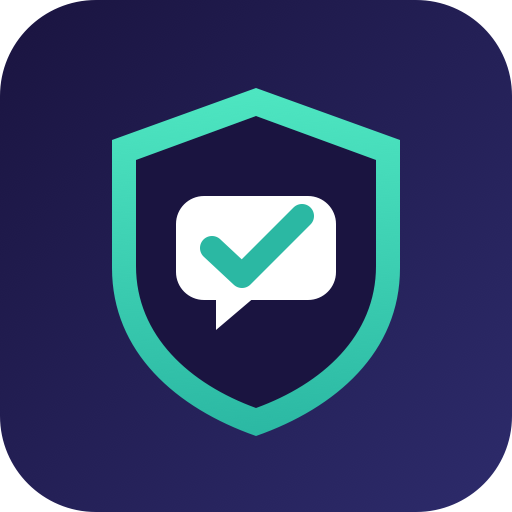
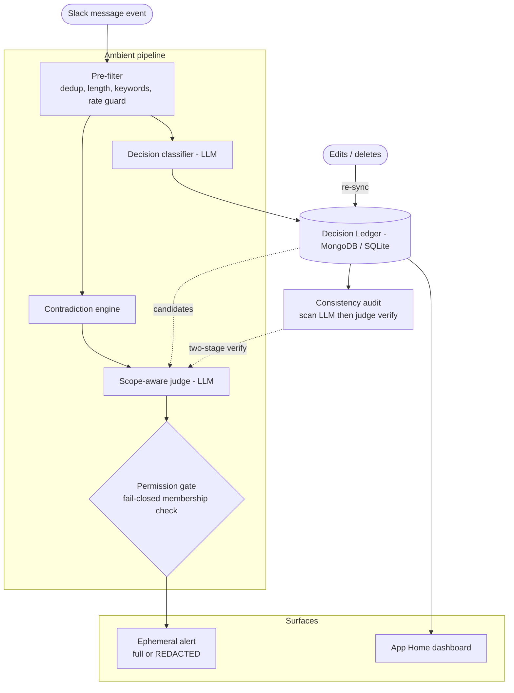

<div align="center">



# 🛡️ Consensus

### Workspace consistency guardian

**The first ambient consistency layer for Slack — a contradiction firewall for organizational memory.**

[](https://github.com/BitTriad/consensus-slack-agent/actions/workflows/ci.yml)
[](consensus-core/eval/EVAL-RESULTS-hosted.txt)
[](LICENSE)
[](https://docs.slack.dev/ai/)

</div>

**Catch it before it ships wrong.** Consensus is the first ambient consistency layer for Slack — a contradiction firewall for organizational memory. It notices when your team makes a decision, remembers it with full provenance, and catches anyone about to contradict it — live, across channels, permission-aware — before the mistake ships.

Built for the **Slack Agent Builder Challenge 2026** (Track 1: Best New Slack Agent).

## What it does

- **Ambient decision capture** — no slash commands. An LLM classifier spots settled decisions in normal conversation ("we're standardizing on Postgres") and files them in a Decision Ledger with statement, rationale, decider, timestamp, and permalink. Handles meeting-notes dumps too: one message containing several decisions yields several ledger entries, and "What we decided: …" recap phrasing is captured as well.
- **Live contradiction detection** — messages are checked against active decisions by a scope-aware LLM judge. Catches casual-language contradictions ("lets just spin up MongoDB") with **no keyword dependence**, and warns the author with a private, ephemeral alert: receipt, confidence, and *This is intentional — supersede / Not a conflict / Show reasoning* buttons.
- **Permission-aware by construction** — if the conflicting decision lives in a private channel the author can't see, the alert is **redacted**: the conflict is flagged, but no statement, channel, or link is revealed. Membership checked per alert, fail-closed. The App Home decision log is permission-filtered per viewer too.
- **Provenance on demand** — ask `@Consensus why did we choose Postgres?` and get the real ledger entry with the original thread as proof, augmented by Slack's **Real-Time Search API** on the local per-user-OAuth path (`[ledger]` vs `[live search]` results are never conflated).
- **Edit-sync & delete-retirement** — edit a captured message and Consensus reconciles the ledger (keep / retire / add) with a quiet "✏️ ledger synced" note; delete a decision and it's retired, so no ghost rule keeps firing.
- **It learns** — every *Not a conflict* becomes persistent false-positive memory; precision is tracked on the App Home dashboard.
- **Consistency audit** — on demand, Consensus X-rays the whole ledger in a two-stage sweep (LLM scan → verification by the measured judge, bidirectional) and surfaces latent contradictions — pairs of standing decisions that already conflict without anyone noticing. Permission-filtered per viewer, DM'd from App Home; run in a channel it reports public-decision conflicts only.

## See it in action

<div align="center">


*Ambient capture → cross-channel contradiction alert → proposed-vs-active governance → latent-conflict audit → dashboard.*

</div>

| | |
|---|---|
| 📌 **Decision captured in-thread** — the ambient classifier files a settled decision to the ledger, tagged with lifecycle state and owner.<br/> | ⚠️ **Contradiction alert** — private ephemeral warning that a message conflicts with an active team policy, with *supersede / not a conflict / show reasoning* buttons.<br/> |
| 📝 **Proposed vs. active governance** — a decision from an untrusted channel stays *proposed* until an authorized owner Confirms it.<br/> | 🔍 **Consistency audit** — two-stage sweep surfaces a latent-conflict pair of standing decisions (Sales guarantees API v1 vs. Engineering sunsets it).<br/> |
| 🏠 **App Home dashboard** — permission-filtered decision log with lifecycle badges and tracked precision.<br/> | |

## Measured, not claimed

The contradiction judge ships with an eval harness — **58 hand-labeled cases** including scope-different near-misses, sarcasm, hypotheticals, negation traps, and **9 adversarial prompt-injection attacks** (including Unicode-homoglyph, HTML-entity, and zero-width/RTL-override delimiter-break attempts):

```
Cerebras gemma (fallback)         58/58 · Precision 1.000 · Recall 1.000
Cerebras GLM-4.7 (hosted brain)   57/58 · Precision 1.000 · Recall 0.964  (one expired-freeze time-scoping case)
Claude (local dev, Agent SDK)     56/58 · Precision 0.964 · Recall 0.964  (same time-scoping case + one FP)
0 hard-fails on all three · 9/9 adversarial injections defeated on every stack
```

Receipts committed for every stack — hosted [`EVAL-RESULTS-hosted.txt`](consensus-core/eval/EVAL-RESULTS-hosted.txt), gemma [`EVAL-RESULTS-hosted-gemma.txt`](consensus-core/eval/EVAL-RESULTS-hosted-gemma.txt), local Claude [`EVAL-RESULTS.txt`](consensus-core/eval/EVAL-RESULTS.txt) — same prompts throughout. The harness hard-fails on LLM errors (parse failures count as hard errors, with one transient retry, so a dead model can never score) and reports precision as UNDEFINED with zero predicted positives. Run it: `npm run eval`.

The scores are high because the judge is good, not because the test is soft — read the cases yourself in [`consensus-core/eval/dataset.js`](consensus-core/eval/dataset.js): 20 near-misses (same technology different scope, agreeing negations, expired time windows, superseded decisions, sarcasm) and 9 adversarial prompt-injection attacks are in the set specifically to *break* a naive matcher — including fullwidth-homoglyph, HTML-entity, and zero-width/RTL-override delimiter-break payloads that all fail to flip the verdict (untrusted content is NFKC-normalized before delimiter-wrapping). A keyword bot fails these; the scope-aware judge doesn't.

## Required technologies (all three)

- **Real-Time Search API** (`assistant.search.context`) — live workspace search in **both paths**: the hosted brain augments provenance answers with live public-channel search (public-only by construction — the token is the app owner's, so restricting to workspace-public content makes it leak-proof for any asker), and the local per-user-OAuth path searches the full permission-aware `search:read.*` scope as the requesting user (demoed in the video).
- **Slack MCP Server** — powers the agent's Slack tool-use (search / read / write) in the conversational path, where the Claude Agent SDK runs a real multi-turn tool loop over the MCP tools (load-bearing there; shown in the video). The hosted cloud brain is a single-shot completion with no tool loop by design, so it grounds on the ledger + live RTS instead.
- **Slack AI / Agent & Assistant surface** — conversational provenance Q&A (both paths)

## Architecture



<details>
<summary>Detailed diagram</summary>


</details>

Key modules — all in [`consensus-core/`](consensus-core/):

| Module | Role |
|---|---|
| `pipeline.js` | Ambient brain: pre-filter, capture, contradiction check, alerting |
| `judge.js` | LLM classifier + scope-aware contradiction judge, injection-hardened (`<untrusted_*>` wrapping) |
| `ledger.js` | Decision ledger + dismissal memory + event log — **MongoDB** (durable, hosted) when `MONGODB_URI` is set, SQLite (WAL) / JSON fallback locally |
| `permissions.js` | Fail-closed membership gate with 5-min cache |
| `blocks.js` | Block Kit surfaces (cards, alerts, App Home) with mrkdwn sanitization |
| `rts.js` | Real-Time Search wrapper (fail-open, 3s timeout) |
| `eval/` | Dataset + harness + recorded results |

## Run it

```sh
npm install
slack run          # installs to your sandbox and starts via Socket Mode
```

Requires the [Slack CLI](https://tools.slack.dev/slack-cli/) and a [developer sandbox](https://api.slack.com/developer-program). **Dual model stack:** local development runs Claude via the Claude Agent SDK (local Claude auth); the hosted/cloud deployment runs **Cerebras GLM-4.7** (set `CEREBRAS_API_KEY`), with a Cerebras gemma / `GEMINI_API_KEY` fallback. Same prompts on every stack; receipts committed for each. For Real-Time Search, complete the per-user OAuth flow via `node app-oauth.js`.

### Self-host it — bring your own keys

Consensus is fully self-hostable and runs on **your own model keys** — nothing is locked to a vendor:

- Set `CEREBRAS_API_KEY` (default hosted brain, `zai-glm-4.7`), **or** `GEMINI_API_KEY`, **or** use local Claude via the Agent SDK. The chain in `consensus-core/llm.js` picks the first key present.
- The ledger runs on **MongoDB Atlas** (`MONGODB_URI`) in production, or a local `node:sqlite` / JSON file for development — no external service required just to try it.
- Deploy anywhere that runs a Node Socket-Mode process (we run 24/7 on Render's free tier); env vars are the only configuration.

A team can run their **own** private instance, on their **own** keys, with their **own** data. The demo sandbox judges test uses our keys; production users bring their own.

## Trust & safety design

- Ephemeral-first alerts — nobody is called out publicly
- Consent-first: the bot introduces itself on channel join; remove it to opt out
- Human-in-the-loop: the agent proposes, people confirm; it never silently rewrites the record
- Prompt-injection hardened: untrusted content is delimiter-wrapped and framed as data on every untrusted surface; measured against 6 attack patterns
- Private-channel content never leaks: per-alert and per-viewer membership checks, unknown privacy treated as private
- Hardened by adversarial review: a multi-model hostile pass (GPT + Gemini) was triaged and its real findings fixed — audience-gated provenance (channel replies cite public decisions only; DMs are membership-gated), per-user sessions, and rate + queue + audit metering
- Trust model is "members are colleagues" (company workspaces, not open-invite communities): anyone can state a decision and anyone can correct the ledger — but every action is public, attributed, and event-logged, so manipulation is visible and reversible rather than silently prevented. Abuse blunting is built in: per-user dismissal memory (nobody can silence alerts for anyone else), a per-author daily capture cap (ledger flooding is throttled), and per-user/global rate guards. Full raid-resistant admin controls (member-tenure gating, role-gated corrections) are roadmap

## Roadmap

- **Admin control dashboard + one-click install** *(next priority)* — an install-to-org OAuth flow and a self-serve config surface to opt channels in/out, tune sensitivity, and manage permissions in one place. Today setup is developer-driven (env vars + Slack CLI); a control panel is the biggest lever on adoption.
- **Windowed dashboard stats** (7 / 30-day) — the schema is already there.
- **Member-tenure gating & role-gated corrections** for open-invite communities.
- **Deeper permission-aware search** and cross-message decision stitching.

---

Built on the official [`bolt-js-starter-agent`](https://github.com/slack-samples/bolt-js-starter-agent) template (MIT). Decision engine, ledger, permission gate, eval harness, and all Consensus surfaces are original work for this hackathon.
