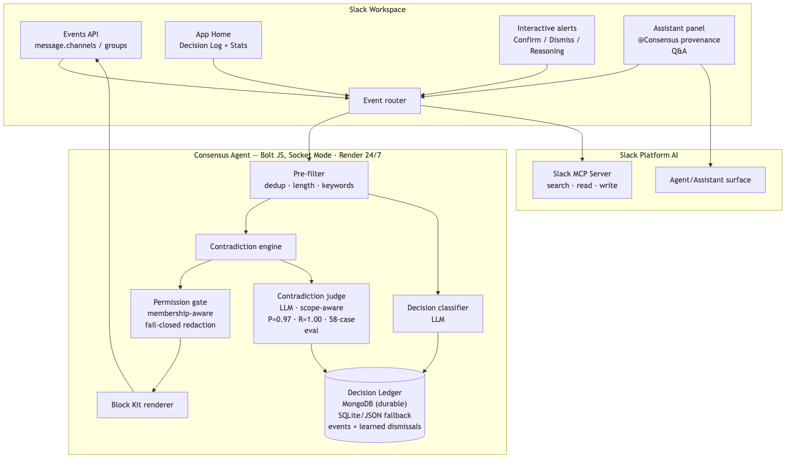

# 🛡️ Consensus — workspace consistency guardian

[](https://github.com/vinayaksonthalia/consensus-slack-agent/actions/workflows/ci.yml)
[](consensus-core/eval/EVAL-RESULTS.txt)
[](LICENSE)
[](https://docs.slack.dev/ai/)

**Catch it before it ships wrong.** Consensus is an ambient Slack agent that notices when your team makes a decision, remembers it with full provenance, and warns anyone about to contradict it — live, across channels, permission-aware.

Built for the **Slack Agent Builder Challenge 2026** (Track 1: Best New Slack Agent).

## What it does

- **Ambient decision capture** — no slash commands. An LLM classifier spots settled decisions in normal conversation ("we're standardizing on Postgres") and files them in a Decision Ledger with statement, rationale, decider, timestamp, and permalink.
- **Live contradiction detection** — messages are checked against active decisions by a scope-aware LLM judge. Catches casual-language contradictions ("lets just spin up MongoDB") with **no keyword dependence**, and warns the author with a private, ephemeral alert: receipt, confidence, and *This is intentional — supersede / Not a conflict / Show reasoning* buttons.
- **Permission-aware by construction** — if the conflicting decision lives in a private channel the author can't see, the alert is **redacted**: the conflict is flagged, but no statement, channel, or link is revealed. Membership checked per alert, fail-closed. The App Home decision log is permission-filtered per viewer too.
- **Provenance on demand** — ask `@Consensus why did we choose Postgres?` and get the real ledger entry with the original thread as proof, augmented by Slack's **Real-Time Search API** (`[ledger]` vs `[live search]` results are never conflated).
- **It learns** — every *Not a conflict* becomes persistent false-positive memory; precision is tracked on the App Home dashboard.

## Measured, not claimed

The contradiction judge ships with an eval harness — **55 hand-labeled cases** including scope-different near-misses, sarcasm, hypotheticals, negation traps, and **6 adversarial prompt-injection attacks**:

```
Precision 1.000 · Recall 0.960 · 0/20 near-miss false-positives · 6/6 injections defeated
```

Full output: [`consensus-core/eval/EVAL-RESULTS.txt`](consensus-core/eval/EVAL-RESULTS.txt). The harness hard-fails on LLM errors (a dead model can never score) and reports precision as UNDEFINED with zero predicted positives. Run it: `npm run eval`.

## Required technologies (all three)

- **Real-Time Search API** (`assistant.search.context`) — live permission-aware workspace search in the provenance path (per-user OAuth, `search:read.*` scopes)
- **Slack AI / Agent & Assistant surface** — conversational provenance Q&A
- **Slack MCP Server** — search/read/write tools available to the agent brain

## Architecture



```
Events API ──▶ pre-filter (dedup · length · keywords) ──▶ decision classifier (LLM) ──▶ Decision Ledger (SQLite)
                                    │                                                        ▲
                                    └─▶ contradiction engine ──▶ scope-aware judge (LLM) ────┘
                                                │
                                                ▼
                                    permission gate (fail-closed) ──▶ ephemeral alert / redacted alert
```

Key modules — all in [`consensus-core/`](consensus-core/):

| Module | Role |
|---|---|
| `pipeline.js` | Ambient brain: pre-filter, capture, contradiction check, alerting |
| `judge.js` | LLM classifier + scope-aware contradiction judge, injection-hardened (`<untrusted_*>` wrapping) |
| `ledger.js` | SQLite (WAL) decision ledger + dismissal memory + event log, JSON fallback |
| `permissions.js` | Fail-closed membership gate with 5-min cache |
| `blocks.js` | Block Kit surfaces (cards, alerts, App Home) with mrkdwn sanitization |
| `rts.js` | Real-Time Search wrapper (fail-open, 3s timeout) |
| `eval/` | Dataset + harness + recorded results |

## Run it

```sh
npm install
slack run          # installs to your sandbox and starts via Socket Mode
```

Requires the [Slack CLI](https://tools.slack.dev/slack-cli/) and a [developer sandbox](https://api.slack.com/developer-program). The LLM runs via the Claude Agent SDK (local Claude auth) or set `GEMINI_API_KEY` for the Gemini fallback. For Real-Time Search, complete the OAuth flow via `node app-oauth.js`.

## Trust & safety design

- Ephemeral-first alerts — nobody is called out publicly
- Consent-first: the bot introduces itself on channel join; remove it to opt out
- Human-in-the-loop: the agent proposes, people confirm; it never silently rewrites the record
- Prompt-injection hardened: untrusted content is delimiter-wrapped and framed as data; measured against 6 attack patterns
- Private-channel content never leaks: per-alert and per-viewer membership checks, unknown privacy treated as private

---

Built on the official [`bolt-js-starter-agent`](https://github.com/slack-samples/bolt-js-starter-agent) template (MIT). Decision engine, ledger, permission gate, eval harness, and all Consensus surfaces are original work for this hackathon.
